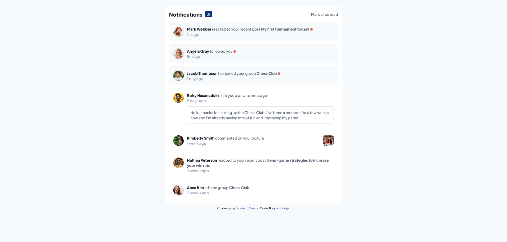

# Frontend Mentor - Notifications page solution

This is a solution to the [Notifications page challenge on Frontend Mentor](https://www.frontendmentor.io/challenges/notifications-page-DqK5QAmKbC). Frontend Mentor challenges help you improve your coding skills by building realistic projects.

## Table of contents

-   [Overview](#overview)
    -   [The challenge](#the-challenge)
    -   [Screenshot](#screenshot)
    -   [Links](#links)
-   [My process](#my-process)
    -   [Built with](#built-with)
    -   [Useful resources](#useful-resources)
-   [Author](#author)

## Overview

### The challenge

Users should be able to:

-   Distinguish between "unread" and "read" notifications
-   Select "Mark all as read" to toggle the visual state of the unread notifications and set the number of unread messages to zero
-   View the optimal layout for the interface depending on their device's screen size
-   See hover and focus states for all interactive elements on the page

### Screenshot

### Links

-   Solution URL: [https://github.com/patricio-jp/frontendmentor-notifications](https://github.com/patricio-jp/frontendmentor-notifications)
-   Live Site URL: [https://patricio-jp.github.io/frontendmentor-notifications/](https://patricio-jp.github.io/frontendmentor-notifications/)

## My process

### Built with

-   Semantic HTML5 markup
-   CSS custom properties
-   Flexbox
-   Mobile-first workflow
-   [Tailwind CSS](https://tailwindcss.com/) - For styles

### Useful resources

-   [HTMLCollection forEach loop - gavsblog](https://www.gavsblog.com/blog/htmlcollection-foreach-loop-convert-object-to-array-javascript) - This was an article I read because I didn't know how to iterate an HTMLCollection. There are several methods you can try, I tried only one method to iterate a HTMLCollection.

## Author

-   Github - [@patricio-jp](https://github.com/patricio-jp)
-   Frontend Mentor - [@patricio-jp](https://www.frontendmentor.io/profile/patricio-jp)
